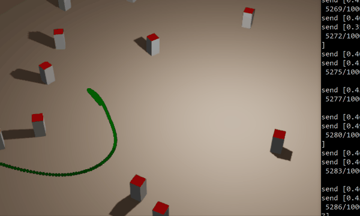

# basicia

This project provide a `WebSocket` communication between `Keras-RL` and `Armory3D`.

## Installation

### Your environment

- Install Python 3.7
- edit requirements.txt: 
  *  if you have Nvidia's GPU use `tensorflow-gpu`. But you have to install [install the SDK 10.0](https://developer.nvidia.com/cuda-10.0-download-archive)
  * otherwise use `tensorflow` 
- install packages: `pip install -r requirements.txt`

### your workspace

- Locate the `.blend` file you are working with
- Create the `Libraries` folder alongside your `.blend` file
- into `Libraries` folder Clone this repository using `git clone https://github.com/armory3d/basicia` 
- Restart Blender and load your `.blend`

## Usage

in order:

1. start the server: your `python` script (see below: §Implement your Agent)
2. start your `Armory3D` project with a `Javascript` target.



## Implement your Agent
fork [runner_exemple.py](Backend/runner_exemple.py) and write your `MyEnv` and `main()` :

```python
from basicia.websocketenv import WebsocketEnv
import basicia.websocketserver 

class MyEnv(WebsocketEnv):

    action_space = <define action space>
    observation_space = <define observation space>
    reward_range = (0, 1) # <- set reward range
     
def main(socket):
    
    # Get the environment and extract the number of actions.
    env = MyEnv(socket) # <-- Build
    
    assert len(env.action_space.shape) == 1
    nb_actions = env.action_space.shape[0]

    # Build your model
    model = [...]

    # Build your agent
    agent = [...]

    # Train, Save, Test
    agent.fit(env, nb_steps=50000, visualize=False, verbose=1, nb_max_episode_steps=200)
    agent.save_weights('ddpg_my_weights.h5f', overwrite=True)
    agent.test(env, nb_episodes=5, visualize=True, nb_max_episode_steps=200)


if __name__ == "__main__":
    # start the service and wait the client 
    basicia.websocketserver.start(main)
```

see also :
 * for instance [runner_example.py](Backend/runner_exemple.py)
 * [Keras-RL overview](https://keras-rl.readthedocs.io/en/latest/agents/overview/)
 * openai [Spaces : Box,Discrete ... ](https://github.com/openai/gym/tree/master/gym/spaces)
        
## Implement your Environment

### Implement `basicia.definitions.IState` :

```haxe

import basicia.definitions.IState;

class MyEnvState implements IState {

    //observation: agent's observation of the current environment
    public final observation :Array<Float>;

    //reward: amount of reward returned after previous action
    public final reward: Float;

    //done: whether the episode has ended, in which case further step() calls will return undefined results
    public final done :Bool; 

    // info: contains auxiliary diagnostic information (helpful for debugging, and sometimes learning)
    public final info : Map<String, String>;
    
    public new(){
        // set fields
    }
}
```

### extends `basicia.iron.WebSocketEnvTrait`

> and attach the trait on an object or the scene!

```haxe
package runner;

import kha.math.Vector3;
import iron.math.Vec4;
import armory.trait.physics.RigidBody;
import basicia.io.WebSocketClientImpl;
import basicia.definitions.IClient;
import basicia.definitions.IState;

import runner.MyEnvActions;
import runner.MyEnvState;

#if arm_debug
import vdebug.VDebug;
#end

class MyEnvTrait extends basicia.iron.WebSocketEnvTrait {

    public function new() {
        super();    
    }
 
    public override function step(commands:Array<Float>): IState {

        // apply commands and return the state
        var state = new MyEnvState(...);
        return state;
    }

    public override function reset():IState {
        // reset/init your environement and return the first state
        var state = new MyEnvState(...);
        return state;
    }
}
```

see for details:
* [Keras-RL Class ](https://github.com/keras-rl/keras-rl/blob/9ea37eb3ad0e51d071c56582f0afe89ceb1526d7/rl/core.py#L607)
* [ OpenIA class](https://github.com/openai/gym/blob/c33cfd8b2cc8cac6c346bc2182cd568ef33b8821/gym/core.py#L8)

 
